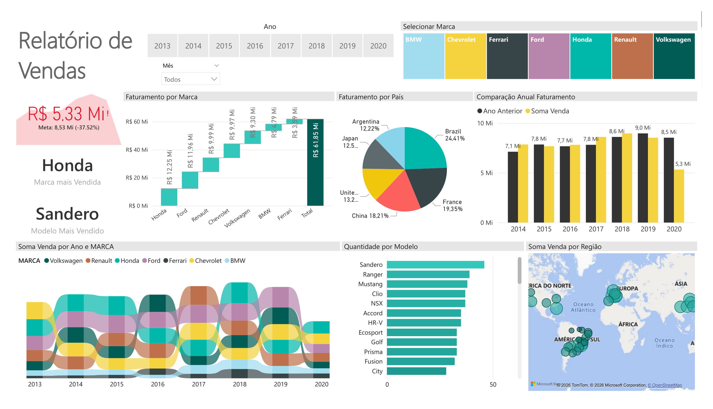
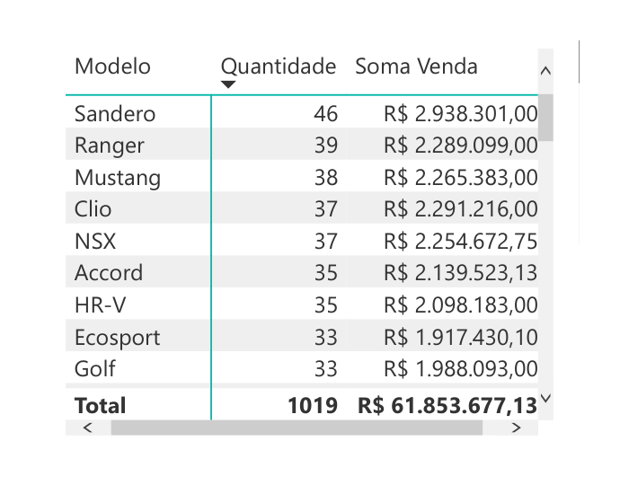
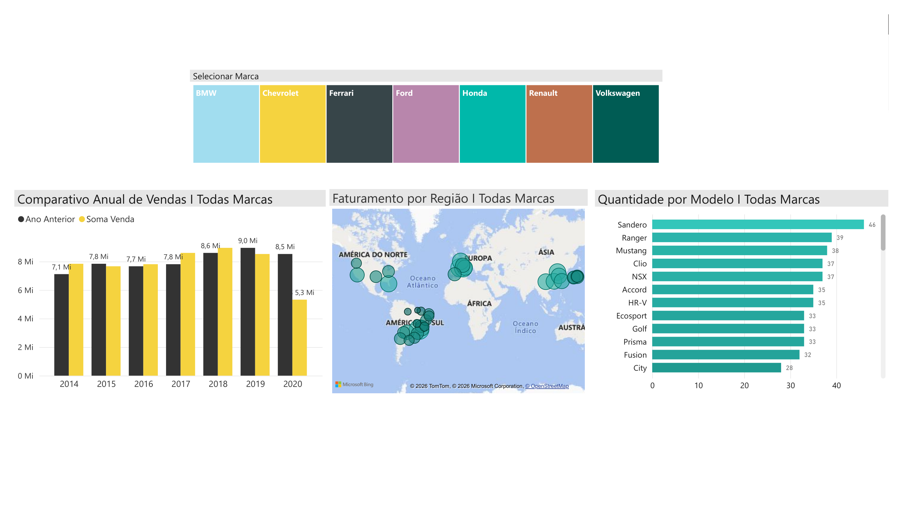

# 📊 Dashboard de Vendas


Projeto desenvolvido em **Power BI** como parte de uma atividade prática de estudos, com o objetivo de aplicar conceitos de **Business Intelligence** na análise de indicadores de vendas.

Durante o desenvolvimento foram aplicadas técnicas de transformação e modelagem de dados, criação de medidas em DAX, desenvolvimento de indicadores (KPIs) e construção de dashboards interativos para transformar dados em informações que apoiam a tomada de decisão.

---

# 📖 Contexto do Projeto

Empresas utilizam dashboards para acompanhar indicadores de desempenho e transformar dados em informações relevantes para o negócio.

Neste projeto foi desenvolvido um dashboard interativo de vendas que permite analisar o desempenho comercial sob diferentes perspectivas, facilitando a identificação de tendências, comparações e oportunidades de análise.

O projeto simula um cenário de análise de vendas, aplicando conceitos de Business Intelligence para apoiar decisões baseadas em dados.

---

# ❓ Perguntas de Negócio

O dashboard foi desenvolvido para responder perguntas como:

- Como as vendas evoluíram ao longo do tempo?
- Quais marcas apresentam melhor desempenho?
- Quais produtos geram maior faturamento?
- Quais países concentram o maior volume de vendas?
- Como os indicadores variam ao aplicar diferentes filtros?
- Quais informações podem apoiar a tomada de decisão?

---

# 🎯 Objetivos

- Monitorar os principais indicadores de vendas.
- Acompanhar a evolução do faturamento.
- Comparar o desempenho de marcas e produtos.
- Analisar a distribuição das vendas por país.
- Facilitar análises por meio de filtros interativos.
- Apoiar decisões orientadas por dados.

---

# 📊 Dashboard

## Página Inicial



---

## Análise de Vendas



---

## Detalhamento



---

# 📈 Indicadores (KPIs)

- Receita Total
- Lucro Total
- Quantidade Vendida
- Total de Pedidos
- Margem de Lucro
- Evolução das Vendas

---

# 🚀 Funcionalidades

- Indicadores (KPIs)
- Segmentação por filtros
- Comparação entre marcas
- Comparação entre produtos
- Análise por país
- Evolução temporal das vendas
- Visualizações interativas
- Navegação dinâmica

---

# 🛠️ Ferramentas Utilizadas

- Power BI
- Power Query
- DAX
- Microsoft Excel

---

# 💼 Competências Desenvolvidas

- Transformação de dados
- Limpeza de dados
- Modelagem de dados
- Criação de medidas em DAX
- Desenvolvimento de KPIs
- Business Intelligence
- Análise de desempenho
- Visualização de dados
- Storytelling com dados
- Desenvolvimento de dashboards interativos

---

# 📂 Estrutura do Repositório

```text
sales-dashboard/

README.md
dashboard_page_1.png
dashboard_page_2.png
dashboard_page_3.png
sales-dashboard.pbix
sales-data.xlsx
```

---

# 📁 Base de Dados

A base de dados utilizada neste projeto possui finalidade educacional e foi utilizada para aplicação prática dos conceitos de Business Intelligence e desenvolvimento de dashboards no Power BI.

---

# 📝 Sobre o Projeto

Este projeto foi desenvolvido durante meus estudos em Power BI com o objetivo de consolidar conhecimentos em Business Intelligence por meio da aplicação prática de conceitos como transformação de dados, modelagem, DAX, criação de indicadores e desenvolvimento de dashboards voltados à análise de vendas.

---

# 📬 Contato

Fique à vontade para se conectar comigo no LinkedIn.

💼 **LinkedIn**  
www.linkedin.com/in/thaynacristinalima
